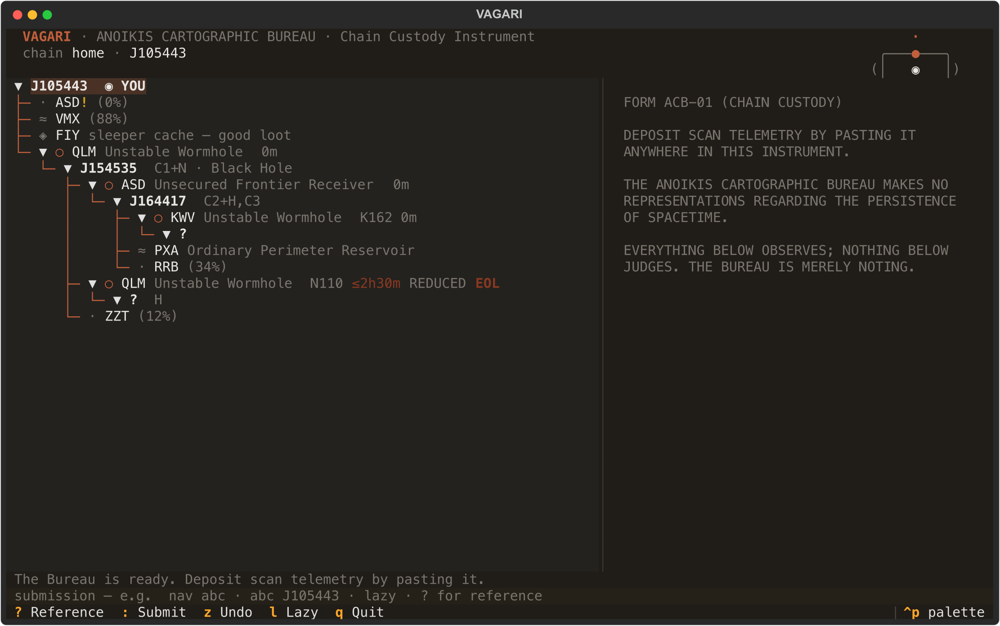

# VAGARI

[](https://github.com/mogglemoss/vagari/releases)
[](https://github.com/mogglemoss/vagari/actions/workflows/build.yml)
[](https://www.python.org/)
[](LICENSE)


> [Cormorant Fell](https://evewho.com/character/93594488) — WiNGSPAN alumni, wormhole resident, and a man whose home address is best described as "recently" — built this. It maps where you have been. It follows where you go. It does not ask why.

**Anoikis Cartographic Bureau · Chain Custody Instrument · Capsuleer Edition**

VAGARI — Latin, *to wander* — is a terminal-based wormhole chain mapper for EVE Online. A TUI: it lives in your terminal, runs on keyboard input, and renders entirely in text. You paste your probe scanner into it. It maintains a chain of custody from your home hole to wherever you have unwisely gone, and — if you let it read your chat logs — it moves your marker as you jump, like a colleague quietly updating the incident report while you make the incident.

Single pilot. Local state. No login, no server, no ESI authentication, no browser tab with fourteen other people's route planning in it. The region is named Anoikis — *homelessness* — and the Bureau considers it fitting that its residents should at least know which way they came in.

```
FORM ACB-01 (CHAIN CUSTODY)

THE ANOIKIS CARTOGRAPHIC BUREAU MAKES NO REPRESENTATIONS REGARDING
THE PERSISTENCE OF SPACETIME.

EVERYTHING BELOW OBSERVES; NOTHING BELOW JUDGES.
THE BUREAU IS MERELY NOTING.
```

---



---

## What It Does

**The chain is a tree.** Systems branch through wormholes; every signature is addressed by its three-letter prefix; your position is marked `◉ YOU`. Views filter the record to what matters right now: everything (`1`), wormholes (`2`), relic/data/ghost sites (`3`), gas (`4`), combat (`5`) — themed views keep the wormhole skeleton. This interaction model is inherited, with respect, from [bashmapper](https://github.com/chloroken/bashmapper) — see Provenance below.

**Deposits are the only ingestion.** Ctrl+A, Ctrl+C in your probe scanner, paste anywhere in the instrument. New signatures are filed, existing ones are enriched — signal strength only rises, names only improve, your labels always survive. The paste is the source of truth and the Bureau reconciles against it; it does not argue with it.

Every deposit also reports which signatures have despawned; press `s` (or submit `sweep`) to strike them from the record. A wormhole with mapped systems behind it is never struck by a sweep. The Bureau does not shred files that other files refer to.

**The map follows you.** VAGARI tails your EVE chat logs (locally; Fenris Creations writes them precisely so tools may read them — enable "Log chat to file" in EVE's settings) and moves `◉ YOU` as you jump — down through mapped holes, back up, or to wherever in the chain you have turned out to be. Multiboxing is understood: every client's log is watched, each tagged with its pilot, and the Bureau follows the first pilot who actually jumps — the one being flown, not the one spamming Jita local. `pilot` reports the roster; `pilot <name>` locks to a character (`VAGARI_PILOT` env for a standing order); `pilot off` releases. Arrive somewhere unmapped and the Bureau files it through the hole you took: if exactly one scanned passage fits, the arrival files itself — destination class, statics, and weather already annotated, no keypress required. When more than one passage could be yours, the dossier lists them as click targets (`k162 <sig>` from the keyboard); `k162!` insists on a fresh unscanned hole, and press `k` when nothing was scanned at all. On a fresh chain, the first system you visit names your root — setup is "start the instrument, undock."

**Wormholes carry countdowns.** Type a hole (`abc H296`) and it knows its target class, mass, size, and book lifetime. The tree shows an upper-bound countdown — `≤13h04m` — amber when waning, and `EXPIRED?` when the paperwork has outlived the physics. Mark end-of-life in one key and the four-hour clock runs from that moment — two hours later the badge honestly reads `≤2h`. The bound is honest: it counts from when *you* first mapped the hole, which is the only fact the Bureau actually possesses.

**The chain watches with you.** Fleetmates' positions appear as `◎ Name` markers wherever their clients are logged in (from the same chatlogs follow-me reads); systems whose scans have gone stale say so (`scanned 9h ago`); and the watchtower flares the mascot and names any chain system that turns hostile between recon sweeps. THE BUREAU IS MERELY NOTING. LOUDLY.

**Reconnaissance, on request.** `recon` files one unauthenticated request to ESI's public kill feed and annotates every system in your chain with last-hour ship, pod, and NPC kills. Offline it declines to guess. THE BUREAU DOES NOT SPECULATE OFFLINE.

**Sites come pre-assessed.** Select any scanned signature and the Bureau files its verdict per the ARCHAEOLOGY and INHALATION circulars: relic and data tiers with their difficulty grades, sleeper sites with their class bands and a warning about the escort, gas reservoirs with their exact fullerite contents down to the unit, and the hazardous paperwork — **TIMED** ghost sites, **CACHE** sleeper caches, **TRAPPED** and **ALARMED** facilities — marked accordingly. The Bureau knows what a Vital Core Reservoir holds. It declines to tell you what it is worth; appraisal is a market activity.

**Finding things.** `/query` searches system names, signature prefixes, site names, and your own labels; repeat it to cycle matches. Name a k-space exit and it quietly gains its security status and region from public ESI. `intel` files a zKillboard dossier on the current system — all-time ships destroyed and recently active hunters — on request only; the Bureau does not pester killboards.

**The map is a forest.** Chains fragment — that is what wormholes do. When a hole collapses (`sever abc`, or automatically when a swept or culled hole has mapped systems behind it), everything on the far side becomes an *adrift fragment*: kept, navigable, follow-me-aware, marked `· adrift` at top level. `fragment [name]` files a disconnected start (nomads begin anywhere); scanning a hole whose destination matches an adrift fragment reattaches it whole. K162 is understood as an *end*, not a type: `abc K162` files an entrance someone opened into you (its true type reads from the far side), and `return ina B274` pairs the far-side sig with the hole you came through while recording the true type from whichever side you read it.

**It teaches itself once.** A fresh install walks you through the first session in three status-line hints — deposit, type a hole, jump — each earned by doing the previous one, then never seen again. FORM ACB-00 (ORIENTATION) is filed exactly once.

**Everything is undoable.** Every mutation is a snapshot; `z` and `Z` walk the record backward and forward without limit of consequence. Multiple chains of custody are maintained with `chain <name>`. The Bureau has never lost a chain. The Bureau has, on occasion, misplaced a pilot.

---

## Installation

Prebuilt binaries for macOS (universal), Linux, and Windows are on the
[releases page](https://github.com/mogglemoss/vagari/releases). Unpack, run `vagari`.

Or install with [uv](https://docs.astral.sh/uv/):

```
uv tool install git+https://github.com/mogglemoss/vagari
```

Or from source:

```
git clone https://github.com/mogglemoss/vagari
cd vagari
uv sync
uv run vagari
```

---

## Configuration

None required. VAGARI auto-detects your EVE chat log directory on macOS, Windows, Linux (Steam/Proton), and Linux (Steam Flatpak). If yours is elsewhere, say so:

```
VAGARI_LOG_DIR=/path/to/EVE/logs/Chatlogs vagari
```

If no logs are found, follow-me simply stays off and the instrument works as a manual mapper. State lives in your platform's application-state directory, one folder per chain, as plain JSON you may read, back up, or ignore.

---

**Keyboard and mouse are equals.** Arrows or clicks move the highlight and the dossier panel follows live; a single click only selects — double-click (or Enter) proceeds through a hole. The dossier's `nav · eol · mass · flag · strike · return` links act on whatever is selected, so the panel is a permanently-open context menu. The submission line offers ghost-text completions (type codes, commands, pilot names) — → accepts. `home` prints the route back to the top, door by door, using return-side sigs where they are on file.

## The Grammar

| Submission | Effect |
|------------|--------|
| *paste* | deposit scan telemetry (implicit add) |
| `sweep` / `cull` | batch strikes: reported despawns · holes past book lifetime |
| `nav abc` | proceed through wormhole ABC |
| `up` / `top` | return toward / to the root |
| `abc J105443` | open ABC to a catalogued system (class, statics, weather) |
| `abc H296` | type wormhole ABC (target class, lifetime, mass) |
| `abc <words>` | label a signature |
| `return abc [TYPE]` | pair ABC with its system's inbound hole (+true type read there) |
| `sever abc` | collapsed hole: far side becomes an adrift fragment |
| `fragment [name]` | file a disconnected fragment (or a pending arrival) |
| `strike vard` / `strike #2` | strike a fragment whole — by name or #number; `d` on its header |
| `copy route` | homeward route to the clipboard |
| `… @system` | address a sig elsewhere in the chain (else: current, then unique) |
| `here <name>` | name the current system |
| `flag abc` / `strike abc` | flag · strike a sig (`strike!` forces; `del` is an alias) |
| `eol abc` / `crit abc` | toggle end-of-life · cycle mass state |
| `k162 [abc]` · `k abc` | file a pending arrival through the hole you took |
| `chain <name>` | switch chain of custody |
| `pilot [name\|off]` | who follow-me follows (multibox); default: first to jump |
| `recon` | refresh system activity from ESI |
| `undo` / `redo` | the record, backward and forward |

| Key | Action |
|-----|--------|
| `Enter` | proceed into the selected wormhole |
| `u` / `g` | up · top |
| `1`–`5` | all · paths · sites · gas · combat views |
| `y` / `h` | cursor to ◉ YOU · route home door by door |
| `e` `m` `x` `d` | EOL · mass · flag · strike (selected sig) |
| `k` | file pending arrival (auto-picks the sole passage) |
| `z` / `Z` | undo · redo |
| `:` | focus the submission line |
| `?` / `a` | reference · about |
| `Ctrl+P` | command palette · `q` quit |

---

## Technical Specifications

| Component | Detail |
|-----------|--------|
| Chain model | Forest of fragments · timestamped signatures · JSON snapshots |
| Undo | Unbounded · one snapshot per mutation · ring of 100 |
| Scanner parsing | Tab-delimited probe scanner paste · keeps signal % |
| Reconciliation | Monotonic merge · labels survive · guarded sweeps |
| J-space catalogue | 2,604 systems · class · statics · weather · shattered |
| Wormhole types | 90 types · target class · mass · lifetime · size |
| Lifetime model | Upper bound from first mapping · EOL clock from marking |
| Follow-me | UTF-16LE chatlog tail · 1 s poll · multibox-aware · pilot lock |
| Activity | ESI system kills · one bulk request · fail-silent · watchtower alerts |
| Network required | Mapping: no · recon: yes |
| Auth required | None · public endpoints only |

---

## Data Sources

| Source | Purpose | Auth |
|--------|---------|------|
| Bundled J-space catalogue | System class, statics, weather, wormhole types | None |
| ESI `/universe/system_kills/` | Last-hour activity per system | None |
| `~/Documents/EVE/logs/` | Live chatlog tailing (follow-me) | Local read |

---

## Platform Support

| Platform | Binaries | Log Auto-Detection |
|----------|----------|--------------------|
| macOS | Universal (arm64 + x86_64) | Yes |
| Windows | Yes | Yes (default Documents path) |
| Linux (Steam/Proton) | Yes | Yes |
| Linux (Steam Flatpak) | Yes | Yes |

---

## A Note on Cartography

VAGARI records where you have been. This is not the same as knowing where you are safe, which is nowhere, or where the chain ends, which is wherever you stop scanning. A wormhole's lifetime countdown is an upper bound computed from the moment you filed it — the hole was older than that when you found it, and holes, like all Bureau clients, decline to state their age.

A mapped chain is most useful when combined with a scanning habit, a healthy fear of K162s, and the understanding that the map being tidy has never once prevented the territory from eating someone.

Wander accordingly.

---

## Provenance

- **Interaction model** — inspired by [bashmapper](https://github.com/chloroken/bashmapper) by **chloroken** (MIT), a ~250-line bash script whose central insight — the chain is a tree, the paste is the truth, three letters address everything — survives here intact. No code is shared; the philosophy is.
- **J-space reference data** — derived from [anoik.is](https://anoik.is)'s static bundle (which itself builds on CCP's Static Data Export), via the Anoikis Cartographic Bureau's own ingest. See [vagari/data/ATTRIBUTION.md](vagari/data/ATTRIBUTION.md).
- **Site intelligence** — the filing rules of the Ministry's ARCHAEOLOGY and INHALATION circulars, as codified in PANTOSCOPE's probe-scan parser and ported here.
- **Sibling instruments** — [HARUSPEX](https://github.com/mogglemoss/haruspex) (proximity intelligence), from which VAGARI inherits its palette, its packaging, its mascot's genus, and its institutional temperament.

---

## License

MIT — see [LICENSE](LICENSE)

---

*Built with [Textual](https://textual.textualize.io). Uses the [EVE Online ESI API](https://esi.evetech.net). Not affiliated with or endorsed by Fenris Creations. EVE Online and all related marks are the intellectual property of Fenris Creations (formerly CCP hf.).*

---

— [Cormorant Fell](https://evewho.com/character/93594488), whereabouts filed under pending
